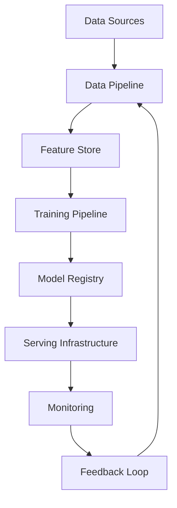
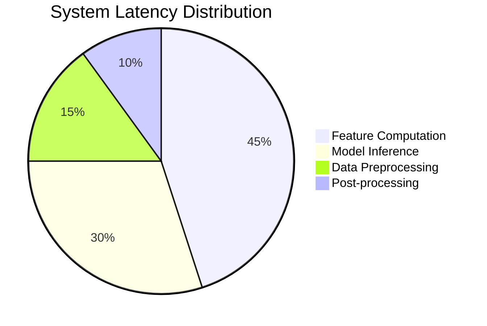
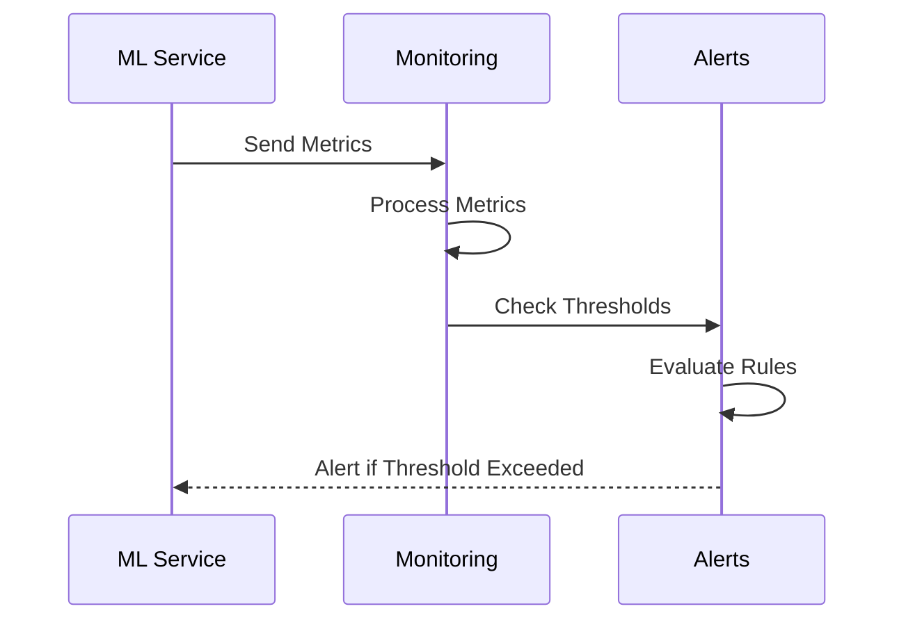

# Machine Learning System Design: A Comprehensive Guide

In this post, we'll explore the key components of designing scalable machine learning systems. We'll cover everything from mathematical foundations to practical implementation considerations.

## Mathematical Foundations

Let's start with the fundamental equation for binary cross-entropy loss:

$$
L = -\frac{1}{N}\sum_{i=1}^N [y_i \log(\hat{y}_i) + (1-y_i)\log(1-\hat{y}_i)]
$$

Where:
- $N$ is the number of samples
- $y_i$ is the true label
- $\hat{y}_i$ is the predicted probability

## System Architecture

Here's a high-level overview of our ML system architecture:



## Implementation Example

Here's a Python code example for implementing a simple feature engineering pipeline:

```python
from typing import Dict, List
import pandas as pd
import numpy as np

class FeatureProcessor:
    def __init__(self, feature_config: Dict[str, str]):
        self.feature_config = feature_config
        
    def process_numerical(self, data: pd.Series) -> np.ndarray:
        """Process numerical features with handling for missing values."""
        return np.where(
            data.isna(),
            data.mean(),
            data.values
        )
    
    def process_categorical(self, data: pd.Series) -> pd.Series:
        """Process categorical features with frequency encoding."""
        return data.map(data.value_counts(normalize=True))

    def transform(self, df: pd.DataFrame) -> pd.DataFrame:
        """Transform the input dataframe based on feature config."""
        processed = {}
        
        for feature, feat_type in self.feature_config.items():
            if feat_type == 'numerical':
                processed[feature] = self.process_numerical(df[feature])
            elif feat_type == 'categorical':
                processed[feature] = self.process_categorical(df[feature])
                
        return pd.DataFrame(processed)
```

## Performance Considerations

When scaling ML systems, we need to consider various performance metrics. Here's a visualization of how different components affect system latency:



## Mathematical Optimization

For large-scale systems, we often need to optimize our models. The gradient descent update rule is given by:

$$
\theta_{t+1} = \theta_t - \alpha \nabla_\theta L(\theta_t)
$$

Where:
- $\theta_t$ is the parameter at time t
- $\alpha$ is the learning rate
- $\nabla_\theta L(\theta_t)$ is the gradient of the loss function

## System Monitoring

Here's a sequence diagram showing our monitoring flow:



## Conclusion

Building scalable ML systems requires careful consideration of both theoretical and practical aspects. The key is to maintain a balance between model complexity and system maintainability.

Remember to:
1. Start with solid mathematical foundations
2. Design for scalability from day one
3. Implement robust monitoring
4. Plan for continuous improvement

Stay tuned for more detailed posts on each of these aspects! 