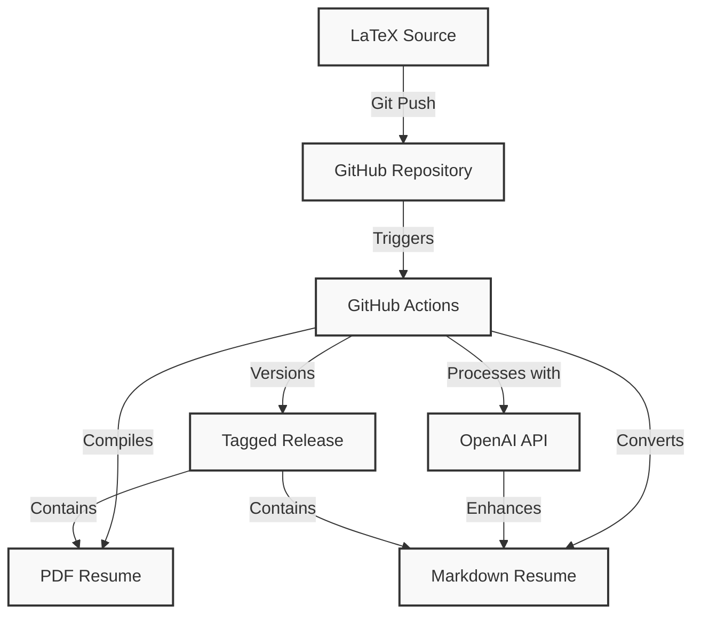
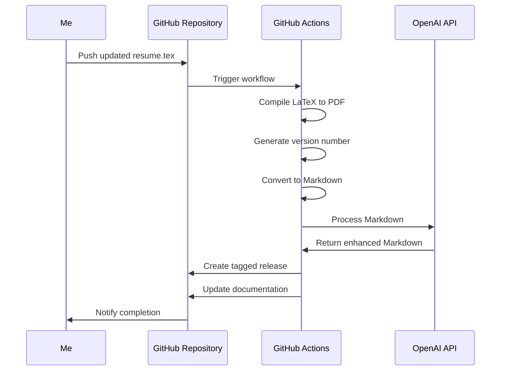

# Automating My Resume with LaTeX, GitHub Actions, and OpenAI API

_Published: April 6, 2025_

Every professional has faced the resume maintenance dance—update content, reformat, convert to PDF, save multiple versions, repeat. As a machine learning engineer who builds automation systems for a living, I couldn't help but think: _there has to be a better way_.

## The Problem: Resume Management Hell

For years, I managed my resume using Microsoft Word and LibreOffice. The process was painfully manual:

1. Open the latest version (if I could find it)
2. Make edits and adjust formatting that inevitably broke
3. Export to PDF
4. Upload to Dropbox
5. Try to remember what version number I was on
6. Repeat every few months

There was no version control, no automation, and certainly no joy in the process. Each update became a small project that took hours away from more meaningful work.

## The Solution: DevOps Principles for Resume Management

What if we treated our resumes like we treat code? With proper version control, CI/CD pipelines, and automated deployment? This question led me down a rabbit hole that transformed how I manage my professional presence.

### The Architecture: Three Technologies in Harmony

The system I built combines three powerful technologies into a seamless workflow:



#### LaTeX: Professional Typesetting

LaTeX isn't just another document format—it's a professional typesetting system used by academics and researchers worldwide. For my resume, it offers several critical advantages:

- **Content/presentation separation**: I can focus on what I've accomplished without worrying about how it looks
- **Consistent formatting**: No more fighting with Word's mysterious formatting quirks
- **Version control friendly**: Being plain text, it works perfectly with Git

My LaTeX template evolved over time to incorporate custom commands that make updates even simpler. For example, I created macros for job entries that ensure consistent formatting:

```latex
\job{Amazon}{Machine Learning Engineer}{2021-Present}{
  \item Developed and maintained machine learning models for Amazon's recommendation systems, improving user engagement and sales
  \item Led the development of a new feature that increased sales by 20%
}
```

#### GitHub Actions: The Automation Backbone

GitHub Actions transformed this system from merely organized to truly automated. My workflow pipeline now:



The beauty of this approach is that I can make a simple text edit to my resume, push it to GitHub, and within minutes have perfectly formatted versions available in multiple formats.

#### OpenAI API: The Intelligent Assistant

The final piece—and what truly elevates this system—is the integration of GPT-4 through the OpenAI API. This isn't just a gimmick; it solves real problems:

- **Markdown enhancement**: Fixes conversion artifacts and ensures proper formatting
- **Information obfuscation**: Intelligently redacts sensitive data while preserving readability
- **Structure preservation**: Maintains proper document structure across formats

## The Implementation: A Closer Look

Let's dive deeper into how this system works in practice.

### The LaTeX Foundation

My resume starts as a LaTeX document with a custom class that defines the visual styling:

```latex
\documentclass[11pt,a4paper,sans]{moderncv}
\moderncvstyle{classic}
\moderncvcolor{blue}

% Personal data
\name{Puneet}{Ludu}
\title{Machine Learning Engineer}
\phone[mobile]{+1~(555)~555~5555}
\email{puneet@example.com}
\social[github]{puneetsl}
\social[linkedin]{puneetludu}
```

### The GitHub Actions Workflow

The heart of the automation is my GitHub Actions workflow file:

```yaml
name: Compile Resume

on:
  push:
    branches: [main, master]
  workflow_dispatch:
    inputs:
      version:
        description: "Version number (e.g., 9.6)"
        required: true
        default: "9.6"

jobs:
  build:
    runs-on: ubuntu-latest
    steps:
      - name: Checkout repository
        uses: actions/checkout@v3

      - name: Set up TeX Live
        uses: xu-cheng/latex-action@v3
        with:
          root_file: resume.tex
          latexmk_use_xelatex: false

      - name: Install Pandoc and Python tools
        run: |
          sudo apt-get update
          sudo apt-get install -y pandoc python3-pip
          pip install openai

      - name: Get version number
        id: get_version
        run: |
          if [ "${{ github.event_name }}" = "workflow_dispatch" ]; then
            echo "VERSION=${{ github.event.inputs.version }}" >> $GITHUB_ENV
          else
            # Smart versioning logic
            if [ -d "versions" ] && [ "$(ls -A versions)" ]; then
              LATEST_VERSION=$(ls -1 versions/puneet_ludu_v*.pdf | sort -V | tail -n 1 | grep -oP 'v\K[0-9]+\.[0-9]+')
              MAJOR=$(echo $LATEST_VERSION | cut -d. -f1)
              MINOR=$(echo $LATEST_VERSION | cut -d. -f2)
              NEW_MINOR=$((MINOR + 1))
              
              if [ $NEW_MINOR -gt 9 ]; then
                NEW_MAJOR=$((MAJOR + 1))
                NEW_MINOR=0
              else
                NEW_MAJOR=$MAJOR
              fi
              
              echo "VERSION=$NEW_MAJOR.$NEW_MINOR" >> $GITHUB_ENV
            else
              echo "VERSION=9.6" >> $GITHUB_ENV
            fi
          fi

      - name: Compile LaTeX
        uses: xu-cheng/latex-action@v3
        with:
          root_file: resume.tex

      - name: Convert to Markdown
        run: |
          pandoc resume.pdf -o resume.md

      - name: Process with OpenAI
        id: openai
        run: |
          python .github/scripts/enhance_resume.py
        env:
          OPENAI_API_KEY: ${{ secrets.OPENAI_API_KEY }}

      - name: Create Release
        uses: actions/create-release@v1
        with:
          tag_name: v${{ steps.get_version.outputs.version }}
          release_name: Resume v${{ steps.get_version.outputs.version }}
          body: Automated resume update
          draft: false
          prerelease: false
```

What makes this workflow special is its smart versioning system. Instead of using simple date-based versions, it implements a more sophisticated approach:

1. **Manual Version Control**: You can trigger the workflow manually with a specific version number
2. **Automatic Versioning**: On regular pushes, it:
   - Finds the latest version in the versions directory
   - Increments the minor version by 1
   - When minor version exceeds 9, increments major version
   - Starts at version 9.6 if no previous versions exist

The workflow also handles several other important tasks:

- Compiles the LaTeX document to PDF
- Maintains a versions directory with all previous PDFs
- Converts the resume to Markdown for web display
- Updates the README with the latest version information
- Creates releases when manually triggered
- Automatically commits and pushes changes back to the repository

### The OpenAI API Integration

The Python script that handles the OpenAI API integration is focused on two main tasks: cleaning up the Markdown conversion and protecting sensitive information:

```python
import os
from openai import OpenAI

# Set OpenAI API key from GitHub Actions secret
client = OpenAI(api_key=os.environ.get("GH_KEY"))

# Read the raw markdown
with open("resume_raw.md", "r") as f:
    raw_markdown = f.read()

# Create a prompt for GPT-4
prompt = f"""
Please clean up this LaTeX-to-Markdown converted resume.
1. Fix any formatting issues
2. Ensure proper Markdown syntax
3. Maintain the structure and hierarchy
4. Remove any LaTeX artifacts or weird formatting
5. Keep the content exactly the same, just improve the formatting

IMPORTANT: Please obfuscate sensitive information in the following way:
- Replace email addresses with the format: username [dot] domain [at] tld
  Example: john.doe@gmail.com → john [dot] doe [at] gmail [dot] com
- Replace phone numbers with obfuscation like
  Example: +1-(123) 456-7890 → +1-(123) four five six seven eight nine zero

Here's the raw markdown:

{raw_markdown}
"""

# Call OpenAI API
response = client.chat.completions.create(
    model="gpt-4",
    messages=[
        {
            "role": "system",
            "content": (
                "You are a helpful assistant that converts LaTeX resumes "
                "to clean Markdown format and obfuscates sensitive info."
            ),
        },
        {"role": "user", "content": prompt},
    ],
    temperature=0.3,
    max_tokens=4000,
)

# Write the cleaned markdown to a file
with open("resume.md", "w") as f:
    f.write(response.choices[0].message.content)
```

What makes this script effective is its focused approach:

1. **Clear Instructions**: The prompt provides specific formatting rules and examples
2. **Privacy Protection**: Built-in obfuscation rules for sensitive information
3. **Consistent Output**: Low temperature (0.3) ensures reliable formatting
4. **Security**: Uses GitHub Actions secrets for API key management

The script is simple but powerful, leveraging GPT-4's ability to understand both document structure and privacy requirements while maintaining the original content's integrity.

## The Transformation: Before vs. After

Let's compare the old and new workflows:

```mermaid
graph TD
    subgraph "Before: Manual Process"
    A1[Edit in Word/LibreOffice] --> B1[Manually Format]
    B1 --> C1[Export to PDF]
    C1 --> D1[Upload to Dropbox]
    D1 --> E1[Rename with Version]
    end

    subgraph "After: Automated Pipeline"
    A2[Edit LaTeX File] --> B2[Git Push]
    B2 --> C2[Automated Pipeline]
    C2 --> D2[Multiple Formats Generated]
    D2 --> E2[Version Tagged Release]
    end

    style A1 fill:#ffdddd,stroke:#333,stroke-width:1px
    style B1 fill:#ffdddd,stroke:#333,stroke-width:1px
    style C1 fill:#ffdddd,stroke:#333,stroke-width:1px
    style D1 fill:#ffdddd,stroke:#333,stroke-width:1px
    style E1 fill:#ffdddd,stroke:#333,stroke-width:1px

    style A2 fill:#ddffdd,stroke:#333,stroke-width:1px
    style B2 fill:#ddffdd,stroke:#333,stroke-width:1px
    style C2 fill:#ddffdd,stroke:#333,stroke-width:1px
    style D2 fill:#ddffdd,stroke:#333,stroke-width:1px
    style E2 fill:#ddffdd,stroke:#333,stroke-width:1px
```



The time savings are dramatic—from hours of tedious work to a simple text edit and git push. But it's not just about time; it's about quality and peace of mind.

## The Impact: Beyond Efficiency

This system has transformed how I think about my professional documents:

1. **Focus on content, not formatting**: I spend my time articulating my accomplishments rather than fighting with formatting
2. **Version history tells a story**: I can see how my career has evolved over time
3. **Instant availability**: My latest resume is always just a URL away
4. **Emergency readiness**: Need to apply for an unexpected opportunity? My resume is always ready
5. **Professional consistency**: Every version maintains the same high-quality formatting

## Lessons Learned: Applying Engineering Principles to Personal Tasks

Building this system taught me several valuable lessons:

1. **Apply engineering principles broadly**: The same DevOps concepts we use for software work for personal productivity
2. **Invest in automation up front**: The initial setup took a weekend, but has saved countless hours since
3. **Embrace plain text**: Text-based formats like LaTeX and Markdown are infinitely more flexible than binary formats
4. **Let AI handle the tedious parts**: GPT-4 excels at formatting and structure tasks that would be tedious manually
5. **Share your solutions**: What seems obvious to you might be revolutionary to someone else

## Next Steps: Expanding the System

This is just the beginning. I'm already working on several enhancements:

- **Tailored versions**: Automatically generate industry-specific resumes
- **Cover letter integration**: Generate customized cover letters based on job descriptions
- **Portfolio synchronization**: Keep my personal website in sync with my resume
- **Skills graph**: Generate a visual representation of my skills and experience

## Resources to Build Your Own

Ready to transform your own resume workflow? Here are the resources you need:

- [My Resume Repository](https://github.com/puneetsl/resume) - See the complete system in action
- [ModernCV LaTeX Template](https://www.latextemplates.com/template/moderncv-cv-and-cover-letter) - The foundation of my resume design
- [GitHub Actions Documentation](https://docs.github.com/en/actions) - Learn how to automate your workflow
- [OpenAI API Documentation](https://platform.openai.com/docs/api-reference) - Explore AI integration possibilities

## Want to Use This System?

The complete automation system described in this post is available as an open-source repository. You can:

1. Fork [my resume repository](https://github.com/puneetsl/Resume)
2. Customize the LaTeX template to match your style
3. Set up your own GitHub Actions secrets
4. Start automating your resume updates

The repository includes:

- Complete GitHub Actions workflow
- LaTeX template with custom commands
- Python script for OpenAI API integration
- Detailed setup instructions

Feel free to adapt it to your needs and contribute improvements back to the community!

## Conclusion: Reimagining the Resume

By treating my resume like a software project—with proper version control, CI/CD, and automation—I've transformed a dreaded chore into a streamlined process. More importantly, I've freed up time and mental energy to focus on what actually matters: building skills and creating impact.

The days of wrestling with Word formatting, manually converting documents, and struggling to maintain versions are over. In their place is a system that respects my time and produces better results.

What manual processes in your life could benefit from an engineer's approach to automation?

---

_Puneet Ludu is a Machine Learning Engineer at Zillow, where he works on the Zestimate team. He's passionate about automation, AI, and building systems that make life easier for developers and professionals._
